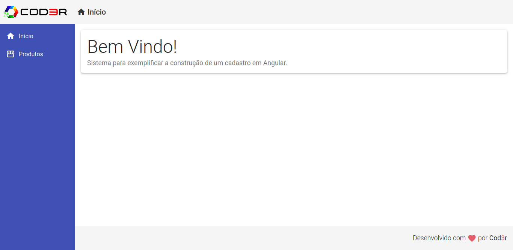

# Angular CRUD
Projeto realizado com Angular 9 simulando um sistema de listagem de produtos. Nesse sistema é possível realizar as operações de adicionar, listar, atualizar e deletar produtos. O backend da aplicação é feito com JSON server.

  

  

  

  

  

  

