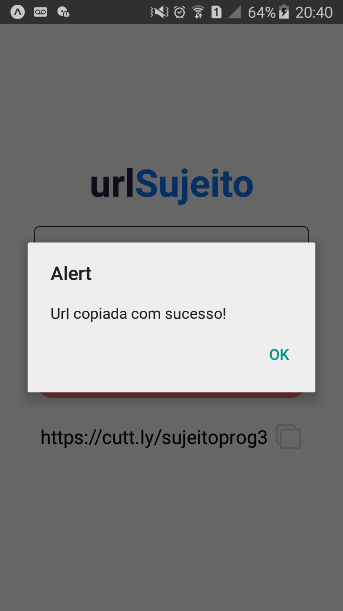

# Encurtador de urls
Projeto realizado com React Native para encurtar urls utilizando a [API gratuita do cuttly](https://cutt.ly/api-documentation/cuttly-links-api). O usuário insere a url que deseja ser encurtada e o nome desejado para o novo link. Ao apertar no botão encurtar, a nova url aparecerá abaixo do botão, podendo ser copiada ao pressioná-la. Feito seguindo vídeo do canal Sujeito Programador.

# App

  
  
  

# Funcionalidades
 - Encurtar urls

## Requisitos
    Instalar o Git
    https://git-scm.com/downloads

    Instalar o NodeJs
    https://nodejs.org/en/

    Instalar o Expo
    https://docs.expo.io/get-started/installation/

# Principais Tecnologias
 - [ReactNative](https://reactnative.dev/)
 - [Expo](https://docs.expo.io/)