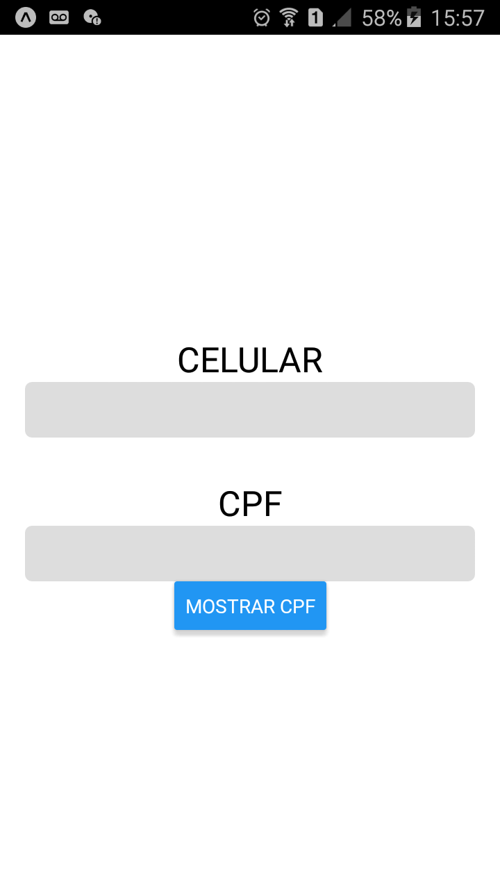
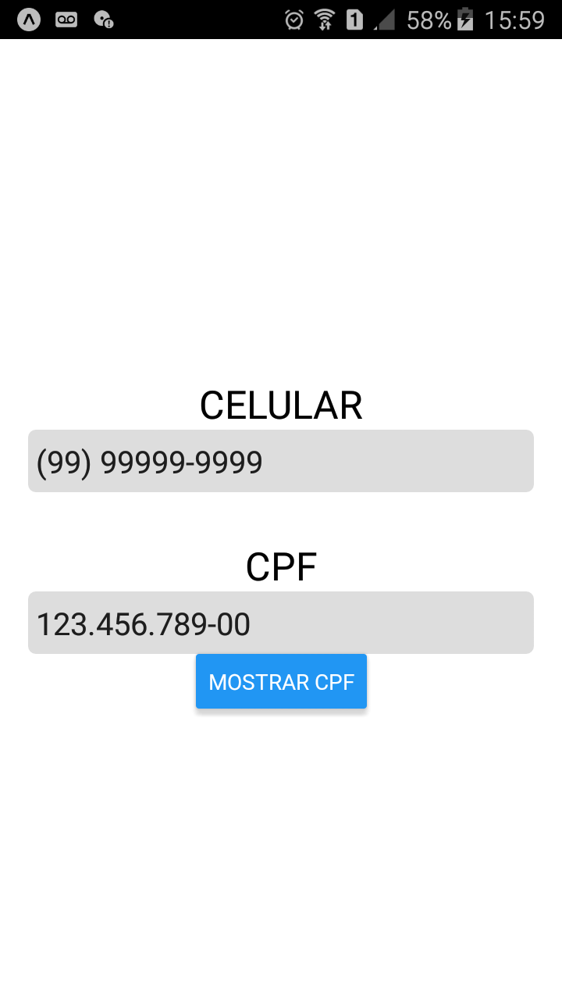
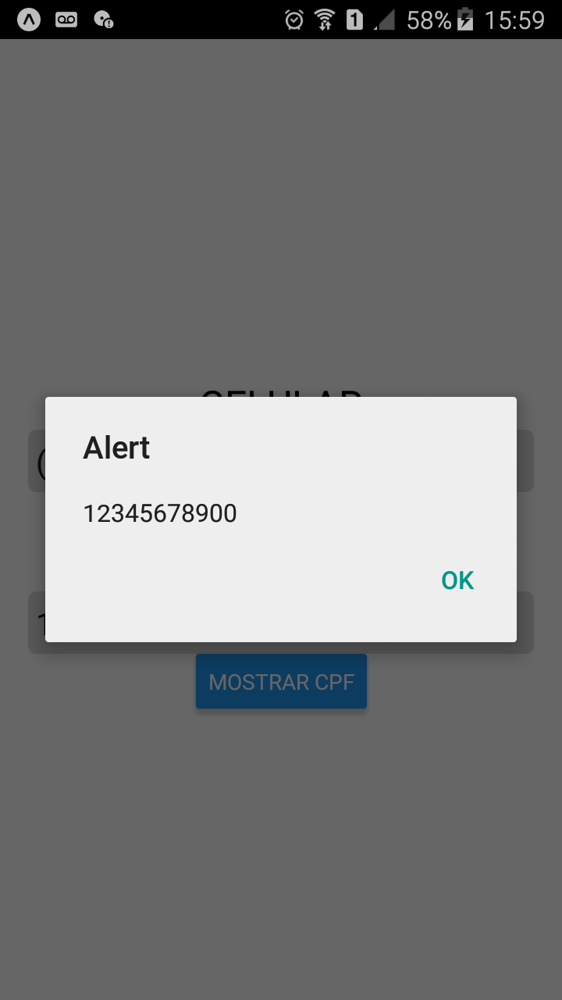

# input-mask
Input de texto com máscara/formatação automática para CPF e número de telefone com DDD.

# Aplicativo

  
  
  

# Funcionalidades
 - Formatação automática de texto para CPF e telefone

# Principais Tecnologias
 - [ReactNative](https://reactnative.dev/)
 - [Expo](https://docs.expo.io/)