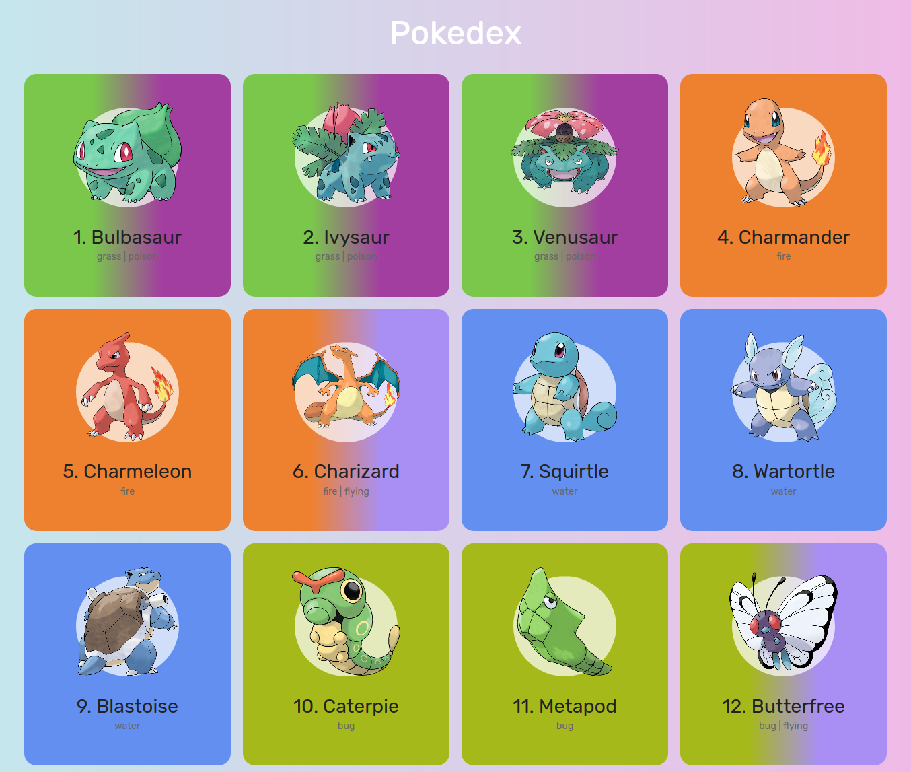
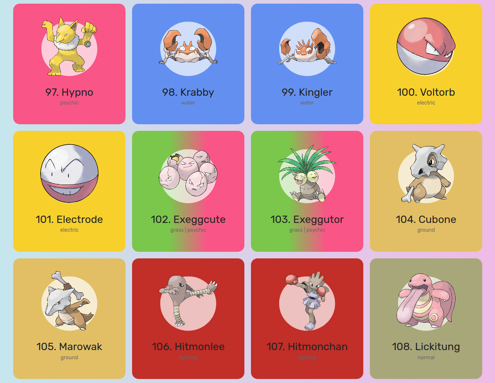
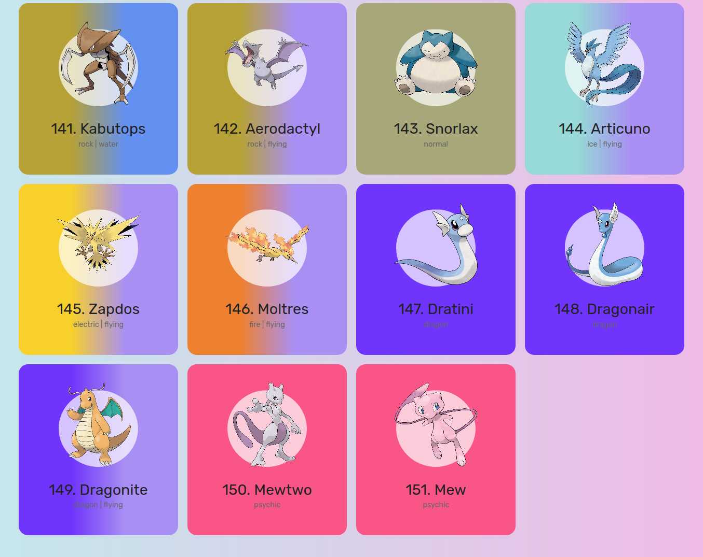

# Pokedex
Aplicação feita com HTML, CSS e JavaScript. Faz listagem dos 151 pokemon informando nome e tipos de cada um. A aplicação faz uso da api [PokéApi](https://pokeapi.co/) para listagem de pokemon

# Aplicação

  

  

  

